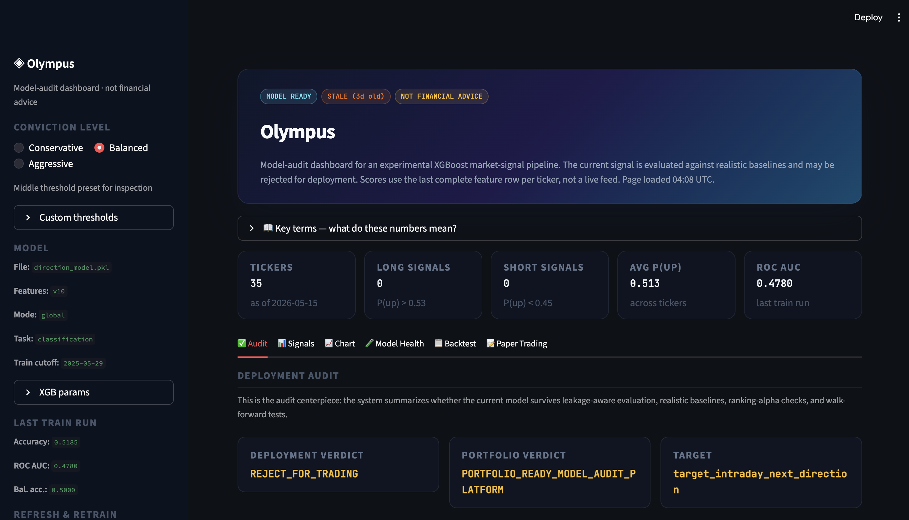
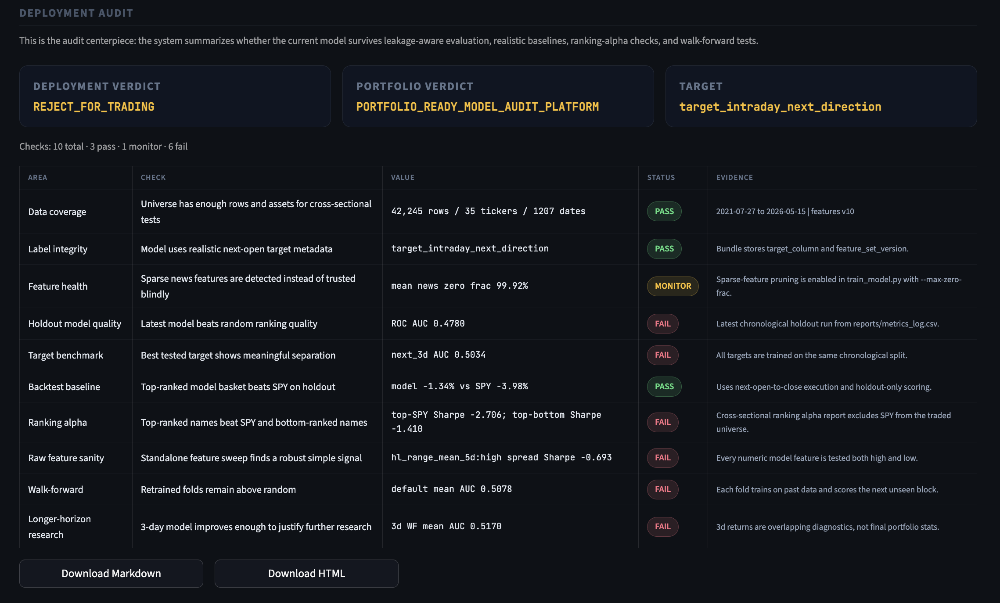
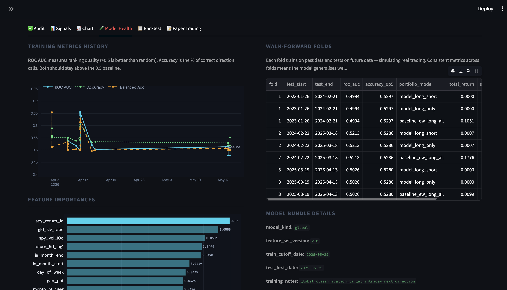
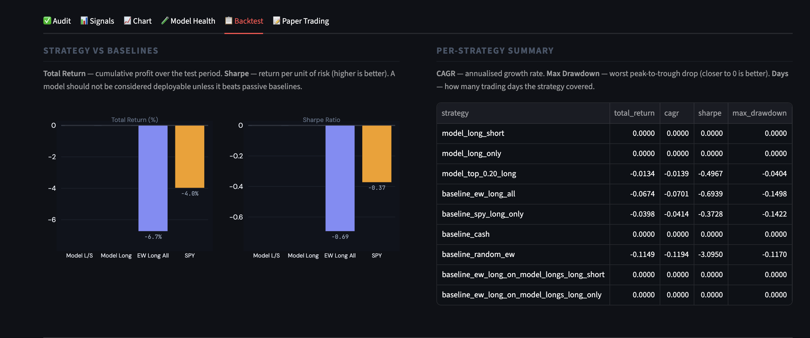
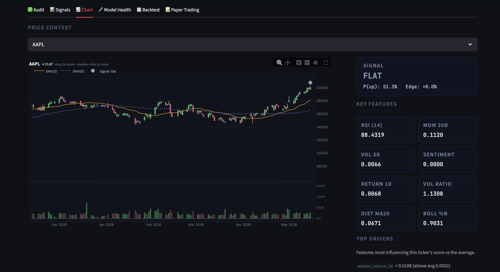

# Olympus

ML research platform for testing short-term market signals with realistic labels, baselines, walk-forward evaluation, and model-audit reporting.

## Key Result

Olympus currently **rejects the saved model for trading** but **passes as a reproducible model-audit platform**. The strongest outcome is not a profitable signal yet; it is the infrastructure that proves when a signal is weak.

Current audit verdict:
- Deployment: `REJECT_FOR_TRADING`
- Project: `PORTFOLIO_READY_MODEL_AUDIT_PLATFORM`

Use `python scripts/portfolio_export.py` to regenerate the audit report and assemble the portfolio artifacts in `portfolio/`.

## Screenshots

### Dashboard Overview


### Model Audit


### Model Health


### Backtest


### Signal Chart


## 1. Scope
- Universe: configurable in `config/universe.csv`; current default is a 35-ticker liquid mix of SPY/QQQ/IWM/DIA, sector ETFs, GLD/SLV/TLT/HYG, and mega-cap equities
- Horizon: next trading day direction + return, plus realistic next-open 3-day/5-day research labels
- Outputs: probability up/down (tabular model); roadmap in `guideline.txt` for richer outputs

## 2. Setup
1. Create environment: `python -m venv .venv` / `conda create -n olympus python=3.11`
2. Activate and install: `pip install -r requirements.txt`
3. Optional: copy `.env` with `FMP_API_KEY`, `NEWSAPI_KEY`, `ALPHA_API_KEY` for news APIs

## 3. First run (v10 realistic-execution features)

**One command (build → train → backtest):** `python scripts/run_pipeline.py`  
Add `--fetch-prices` and/or `--fetch-news` to refresh CSVs first; `--no-per-ticker` matches `train_model.py`. Extra flags are forwarded to `train_model.py` (e.g. `python scripts/run_pipeline.py --test-frac 0.25`).  
With news refresh: `python scripts/run_pipeline.py --fetch-news --fmp-stock-backfill-days 90` runs FMP **Search Stock News** backfill (needs API access) plus the usual **fmp-articles** pull; **new rows merge into `news.csv`** (deduped) instead of overwriting.

---
1. **Prices:** `python scripts/fetch_price_data.py` (or keep existing `data/*_daily.csv`). Use `--tickers AAPL,MSFT,SPY` for a one-off subset or edit `config/universe.csv`.
2. **News:** `python scripts/fetch_news.py` — writes `date`, `published_at` (ISO UTC), sentiment; **merges by default** (deduped) so history accumulates. Uses the same configurable universe. Options: `--no-merge` overwrite; `--fmp-stock-backfill-days N` for **per-ticker** FMP stock news over the last N days (chunked; plan may require upgrade). Re-run after upgrades so timestamps exist for window features.
3. **Features:** `python scripts/build_features.py` — **v10** keeps latest live rows even when future labels are unknown, adds `target_intraday_next_direction`, `target_return_next_open_to_close`, and realistic next-open-to-future-close 3d/5d labels, and sets `target_excess_up` to missing for SPY so the excess model cannot get free AUC by identifying the benchmark. Price + cross-asset + cross-section + news windows as before. **`python scripts/audit_data.py`** — prints class balance, missing-label rates, and **news column % zeros** (if everything is zero, refresh news or expect news features to be pruned in training).
4. **Train:** `python scripts/train_model.py` — **`--target`** `next_intraday` (default) | `next_3d` | `next_5d` | `direction` | `excess` | `direction_5d`; **`--task regression`** + **`--reg-target`**; **`--light`**; **`--no-per-ticker`** global-only. Chronological split; **early stopping** (disable with `--early-stopping-rounds 0`); Platt calibration (classification); recency weights; variance prune (**`--variance-min-std`**) and sparse-feature prune (**`--max-zero-frac 0.995`** by default, useful while news is mostly zero). **XGB tuning (optional):** `--learning-rate`, `--n-estimators`, `--max-depth`, `--min-child-weight`, `--reg-lambda`, `--reg-alpha`, `--gamma`, `--subsample`, `--colsample-bytree`, `--colsample-bylevel` — saved in the bundle as `xgb_extra`. **`reports/metrics_log.csv`** logs each run.
5. **Backtest:** `python scripts/evaluate_backtest.py` — equal-weight daily portfolio, **holdout only** by default. The default execution mode is now **`--execution-price next_open_to_close`**, which assumes signals are generated after today's close, entered next open, and exited next close. Use `--execution-price close_to_close` only to reproduce older research reports. `next_open_to_close_3d` / `next_open_to_close_5d` are available as overlapping signal-horizon diagnostics, not finalized portfolio simulations. By default runs **two** model modes vs baselines: **long/short/flat** and **long-only**. **Fair-ish baseline:** *EW long only on names/days where the model is long* (same 5 bps on those longs as the model). **`--by-month`** → `reports/backtest_by_month.csv`. **`--folds N`** → print per-fold metrics on the holdout (same trained model; checks stability, not full walk-forward retrain). Thresholds: `--long-threshold` / `--short-threshold`. Writes `reports/backtest_portfolio.csv`, `reports/backtest_comparison.csv`, `reports/backtest_per_ticker.csv`.

Backtest flags: `--cost-bps 5`, `--execution-price close_to_close`, `--execution-price next_open_to_close_5d`, `--full-sample` (includes training period; metrics look optimistic)

**Walk-forward (retrain each fold):** `python scripts/walk_forward_eval.py` — expanding window; refit each fold; writes `reports/walk_forward.csv`. Defaults: **global** model (fast), `--folds 4`, `--min-train-days 400`, `--target next_intraday`, and `--execution-price next_open_to_close`. Use **`--per-ticker`** for per-ticker training (slow, closer to prod). **`--target`** matches `train_model.py`. **`--light`** supported.

**Target benchmark (holdout):** `python scripts/benchmark_model.py` — trains and scores `next_intraday`, `next_3d`, `next_5d`, `direction`, `excess`, and `direction_5d` on the same chronological split; add **`--per-ticker`** for prod-like stacks. Writes `reports/model_target_benchmark.csv`. Optional **`--save-best PATH`** saves the bundle with highest holdout ROC AUC.

**Portfolio export:** `python scripts/portfolio_export.py` — regenerates the deployment audit, copies key result tables into `portfolio/artifacts/`, and writes `portfolio/README.md`.

**Model audit only:** `python scripts/generate_model_audit_report.py` — creates a deployment audit with pass/monitor/fail gates, writes `portfolio/olympus_model_audit_report.md`, `portfolio/olympus_model_audit_report.html`, and `reports/model_audit_summary.csv`. The companion case study lives at `portfolio/olympus_case_study.md`.

**Feature A/B:** `python scripts/compare_v5_v6.py` (v5 vs v6 columns) · `python scripts/compare_v6_v7.py` (v6 vs v7 columns) — trains two bundles and prints holdout metrics side by side.

**Threshold tuning:** `python scripts/threshold_sweep.py` — grid over `--long-threshold` for **long-only** rules on the holdout; writes `reports/threshold_sweep.csv` and prints best Sharpe / return rows.

**Cross-sectional “conviction”:** `python scripts/evaluate_backtest.py --long-top-pct 0.33` — each day, **long only the top 33%** of tickers by `pred_prob` (and compare to fixed thresholds in the same run).

**Ranking / alpha evaluation:** `python scripts/evaluate_ranking_alpha.py --top-n 2` — ranks the non-SPY universe by model score each day and writes `reports/ranking_alpha_summary.csv`, `reports/ranking_alpha_daily.csv`, `reports/ranking_alpha_by_month.csv`, and `reports/ranking_alpha_buckets.csv`. Key checks: top-ranked return, top-minus-bottom spread, top-minus-SPY spread, equal-weight ranked universe, and Spearman information coefficient. This is the main sanity check for whether the model has useful ordering power.

**Raw feature sweep:** `python scripts/sweep_rank_features.py --top-n 2` — tests every numeric model feature in both directions as a standalone rank signal. Writes `reports/rank_feature_sweep.csv`, `reports/rank_feature_sweep_daily.csv`, `reports/rank_feature_sweep_by_month.csv`, and `reports/rank_feature_sweep_buckets.csv`. Use `--date-from YYYY-MM-DD --out-dir reports/recent_rank_feature_sweep` for recent-window checks before promoting any signal into a model.

**Walk-forward feature selection:** `python scripts/walk_forward_feature_sweep.py --folds 3 --top-k 5 --top-n 2` — selects the best raw feature+direction signals using only each fold's training window, then evaluates those selections on the next unseen block. Writes `reports/wf_feature_sweep.csv`, `reports/wf_feature_sweep_selected.csv`, `reports/wf_feature_sweep_daily.csv`, and `reports/wf_feature_sweep_by_month.csv`. This is the main guard against choosing raw features with hindsight.

If you hit OpenMP shared-memory errors (e.g. in some sandboxes), run with `OMP_NUM_THREADS=1` (and on Intel builds sometimes `KMP_USE_SHM=0`).

**Live tracking (recommended):** After refreshing prices/news and rebuilding features, score the latest row per ticker and **append** to an audit log:  
`python scripts/live_score.py --append-log` → `reports/prediction_log.csv`. When `features.csv` next includes realized `target_intraday_next_direction` for those dates, check calibration:  
`python scripts/evaluate_live_log.py` (accuracy / AUC / Brier on logged rows). Prefer **walk-forward** for deployment realism: `python scripts/run_pipeline.py --walk-forward` runs `walk_forward_eval.py` after train+backtest (adds OOS folds with **retrain per fold**; slow).

## Demo UI (Streamlit) — Olympus
After `build_features` + `train_model`, install UI deps (`pip install streamlit plotly`) and run from the project root:

```bash
streamlit run demo/app.py
```

Opens a browser dashboard: audit verdict, model health, latest row per ticker, rule-based long/short/flat inspection, and a price chart from `data/<TICKER>_daily.csv`.

## 4. Structure
- `demo/` Olympus Streamlit dashboard (`demo/app.py`)
- `utils/` shared inference (`predict_bundle.py` — classification + regression bundles), Platt calibration (`platt_calibration.py`)
- `scripts/` ETL, features, training, evaluation; `run_pipeline.py` chains the main steps
- `data/` CSV inputs and `features.csv`
- `models/` trained bundles
- `reports/` backtest CSVs, `metrics_log.csv`, optional `prediction_log.csv` (from `live_score.py --append-log`), `walk_forward.csv`
- `guideline.txt` project plan
