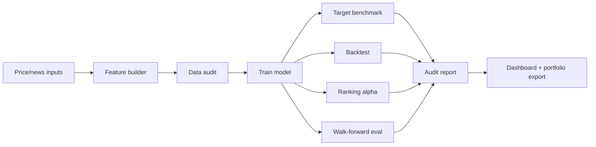

# Olympus: Honest ML Evaluation for Market Signals

## One-Line Summary

Olympus is a Python ML research platform that tests whether short-term market signals survive realistic evaluation, then rejects weak models instead of overstating them.

## Problem

It is easy to make a market model look good with the wrong setup: random train/test splits, close-to-close assumptions, hidden benchmark leakage, or cherry-picked accuracy. I wanted Olympus to answer a harder question:

> Does this model show real signal after realistic labels, baselines, walk-forward testing, and ranking-alpha checks?

## What I Built

- A configurable 35-asset research universe covering broad ETFs, sectors, commodities, rates, credit, and large-cap equities.
- A feature pipeline for price action, volatility, trend, cross-asset context, cross-sectional ranks, sparse news features, and leakage-aware targets.
- XGBoost training with chronological splits, calibration, recency weighting, global/per-ticker modes, variance pruning, and sparse-feature pruning.
- Evaluation scripts for target benchmarking, realistic execution backtests, threshold sweeps, walk-forward retraining, ranking alpha, and raw feature sweeps.
- A Streamlit dashboard focused on model health, audit status, backtests, and signal inspection.
- A generated deployment audit report with pass/monitor/fail gates.
- A test suite covering feature generation, prediction bundles, evaluation helpers, CLI behavior, and audit-report logic.

## Architecture

## Evaluation Design

Olympus uses several checks that make the model harder to fool:

- **Chronological split:** Train on past dates, evaluate on future dates.
- **Realistic execution:** Default target assumes signals are generated after the close, entered next open, and exited next close.
- **Benchmark leakage guard:** SPY is removed from the excess-return label so the model cannot earn free AUC by identifying the benchmark row.
- **Walk-forward retraining:** Each fold retrains only on history available before the test block.
- **Ranking alpha:** Each day ranks non-SPY assets and tests top-minus-bottom and top-minus-SPY spreads.
- **Raw feature sweep:** Tests every numeric feature in both directions as a standalone rank signal.
- **Sparse-feature pruning:** Detects mostly empty news/sentiment columns instead of trusting them blindly.

## Key Result

The current model is **not deployment-ready**.

The audit report rejects it for trading because:

- The default next-day model does not beat random ranking quality.
- The best tested target improves only slightly and still does not show meaningful separation.
- Top-ranked assets do not reliably beat SPY or bottom-ranked assets.
- Standalone feature sweeps do not reveal a robust simple signal.
- Walk-forward results are not strong enough to justify deployment.

That is the point of the project: Olympus does not just produce predictions. It tests whether those predictions deserve trust.

## Why This Is Portfolio-Worthy

The strongest engineering story is not “I built a profitable trading bot.” It is:

> I built an ML market-signal platform, discovered that the first signal was weak, and redesigned the system to audit leakage, execution realism, ranking alpha, baselines, and walk-forward stability.

This shows practical ML judgment: building a full pipeline, finding failure modes, adding reproducible tests, and communicating model limitations clearly.

## Screenshots To Add

Add screenshots to `portfolio/screenshots/`:

- `audit_tab.png` - dashboard audit verdict and checklist.
- `model_health_tab.png` - training metrics and walk-forward section.
- `backtest_tab.png` - strategy vs baselines.
- `audit_report_html.png` - generated HTML audit report.

Suggested portfolio layout:

1. Hero: project title and one-line summary.
2. Screenshot: audit tab.
3. Architecture diagram.
4. Evaluation design.
5. Key result and audit verdict.
6. What I would improve next.

## Key Files

- `scripts/build_features.py` - feature generation and leakage-aware labels.
- `scripts/train_model.py` - model training, calibration, weighting, and pruning.
- `scripts/evaluate_backtest.py` - realistic execution backtests and baselines.
- `scripts/evaluate_ranking_alpha.py` - cross-sectional ordering tests.
- `scripts/walk_forward_eval.py` - retrain-each-fold validation.
- `scripts/sweep_rank_features.py` - raw feature sanity checks.
- `scripts/generate_model_audit_report.py` - deployment audit report.
- `scripts/portfolio_export.py` - curated portfolio artifact export.
- `demo/app.py` - Streamlit dashboard.

## Next Research Steps

- Add sector-relative strength, rolling beta, and market-regime features.
- Add VIX, rates, credit-spread, and volatility context.
- Build a non-overlapping multi-day portfolio simulator.
- Replace sparse news input with broader timestamped coverage or remove news features from the active feature list.
- Keep the audit report as the promotion gate before any paper-trading or deployment claim.
